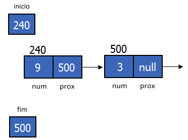

# Lista Ligada

## Definição

Uma lista ligada é uma estrutura de dados que consiste em um conjunto de elementos, chamados de nós, que estão ligados uns aos outros por meio de ponteiros. Cada nó contém um valor e um ponteiro para o próximo nó da lista. O primeiro nó da lista é chamado de nó cabeça e o último nó é chamado de nó cauda. O ponteiro do último nó aponta para um endereço nulo.

A lista é inicializada com um nó cabeça que aponta para o primeiro nó da lista. A lista é percorrida a partir do nó cabeça até o nó cauda.
Como a lista não contém nenhum elemento no início, o nó cabeça é inicializado com um valor nulo.


A calda da lista é o último nó da lista. O ponteiro do último nó aponta para um endereço nulo. Abaixo é mostrado um exemplo de uma lista ligada vazia.


Em C a lista ligada é implementada por meio de uma estrutura de dados. A estrutura de dados contém um campo para armazenar o valor do nó e um ponteiro para o próximo nó da lista.

```c
struct Node {
    int valor;
    struct Node* proximo;
};
```

Uma vez feita a estrutura de dados, é possível criar uma lista ligada. A lista ligada é inicializada com um nó cabeça que aponta para o primeiro nó da lista. O nó cabeça é inicializado com um valor nulo.

```c
struct Node* inicio = NULL;
```

OBS: A lista ligada é uma estrutura de dados dinâmica, ou seja, o tamanho da lista pode ser alterado durante a execução do programa. É possivel também criar uma lista ligada como uma noava estrutura de dados. Dessa forma a Lista teria um campo para o nó cabeça e um campo para o nó cauda.

vamos verificar essa estrutura no futuro, por enquanto vamos focar na estrutura de um nó.


## Operações Básicas

As operações básicas de uma lista ligada são:

- Inserção: Adiciona um novo nó à lista.
- Remoção: Remove um nó da lista.
- Busca: Procura um nó na lista.
- Impressão: Imprime os elementos da lista.
- Tamanho: Retorna o número de elementos da lista.
- Vazia: Verifica se a lista está vazia.

### Inserção

A operação de inserção adiciona um novo nó à lista. O novo nó é inserido no início da lista. O ponteiro do novo nó aponta para o nó cabeça e o ponteiro do nó cabeça aponta para o novo nó.

 

Para inserir mais um nó, o novo nó é inserido no início da lista. O ponteiro do novo nó aponta para o nó cabeça e o ponteiro do nó cabeça aponta para o novo nó.

 

Para implementar uma inserção em uma lista ligada, é necessário criar um novo nó e atribuir um valor a ele. O ponteiro do novo nó aponta para o nó cabeça e o ponteiro do nó cabeça aponta para o novo nó.

```c
struct Node* novo = (struct Node*)malloc(sizeof(struct Node));

novo->valor = 10;
novo->proximo = inicio;
inicio = novo;
```

### Remoção

A operação de remoção remove um nó da lista. O nó a ser removido é o primeiro nó da lista. O ponteiro do nó cabeça aponta para o próximo nó da lista e o nó a ser removido é liberado da memória.


Para remover um nó de uma lista ligada, é necessário criar um ponteiro temporário para armazenar o nó a ser removido. O ponteiro do nó cabeça aponta para o próximo nó da lista e o nó a ser removido é liberado da memória.

```c
struct Node* temp = inicio;
inicio = inicio->proximo;
free(temp);
```

### Busca

A operação de busca procura um nó na lista. A busca é feita percorrendo a lista a partir do nó cabeça até o nó cauda. Se o nó for encontrado, a busca retorna verdadeiro; caso contrário, a busca retorna falso.

```c
int busca(int valor) {
    struct Node* temp = inicio;
    while (temp != NULL) {
        if (temp->valor == valor) {
            return 1;
        }
        temp = temp->proximo;
    }
    return 0;
}
```

### Impressão

A operação de impressão imprime os elementos da lista. A impressão é feita percorrendo a lista a partir do nó cabeça até o nó cauda.

```c
void imprime() {
    struct Node* temp = inicio;
    while (temp != NULL) {
        printf("%d ", temp->valor);
        temp = temp->proximo;
    }
    printf("\n");
}
```

### Tamanho

A operação de tamanho retorna o número de elementos da lista. O tamanho é calculado percorrendo a lista a partir do nó cabeça até o nó cauda.

```c
int tamanho() {
    int tam = 0;
    struct Node* temp = inicio;
    while (temp != NULL) {
        tam++;
        temp = temp->proximo;
    }
    return tam;
}
```

### Vazia

A operação de vazia verifica se a lista está vazia. A verificação é feita comparando o nó cabeça com um valor nulo.

```c
int vazia() {
    return inicio == NULL;
}
```
A função acima retorna 1 se a lista estiver vazia e 0 caso contrário.

## Exemplo

A seguir é mostrado um exemplo de uma lista ligada em C.

```c
#include <stdio.h>

struct Node {
    int valor;
    struct Node* proximo;
};

struct Node* inicio = NULL;

void insere(int valor) {
    struct Node* novo = (struct Node*)malloc(sizeof(struct Node));
    novo->valor = valor;
    novo->proximo = inicio;
    inicio = novo;
}

void remove() {
    struct Node* temp = inicio;
    inicio = inicio->proximo;
    free(temp);
}

int busca(int valor) {
    struct Node* temp = inicio;
    while (temp != NULL) {
        if (temp->valor == valor) {
            return 1;
        }
        temp = temp->proximo;
    }
    return 0;
}

void imprime() {
    struct Node* temp = inicio;
    while (temp != NULL) {
        printf("%d ", temp->valor);
        temp = temp->proximo;
    }
    printf("\n");
}

int tamanho() {
    int tam = 0;
    struct Node* temp = inicio;
    while (temp != NULL) {
        tam++;
        temp = temp->proximo;
    }
    return tam;
}

int vazia() {
    return inicio == NULL;
}

int main() {
    insere(10);
    insere(20);
    insere(30);
    insere(40);
    insere(50);

    imprime();
    printf("Tamanho: %d\n", tamanho());

    remove();
    remove();

    imprime();
    printf("Tamanho: %d\n", tamanho());

    printf("Busca: %d\n", busca(20));
    printf("Busca: %d\n", busca(30));

    return 0;
}
```

O programa acima cria uma lista ligada com os valores 10, 20, 30, 40 e 50. Em seguida, imprime os elementos da lista e o tamanho da lista. Depois, remove os dois primeiros elementos da lista e imprime os elementos da lista e o tamanho da lista. Por fim, verifica se os valores 20 e 30 estão na lista.

## Referências

- [Wikipedia](https://en.wikipedia.org/wiki/Linked_list)

- [GeeksforGeeks](https://www.geeksforgeeks.org/data-structures/linked-list/)

- [Programiz](https://www.programiz.com/dsa/linked-list)
